#  TaskFlow — Full Stack Task Management App

##  Overview

TaskFlow is a full-stack web application that allows users to manage projects and tasks efficiently.
It includes authentication, protected routes, and full CRUD operations.

---

##  Features

###  Authentication

* User registration and login
* JWT-based authentication
* Protected API routes

###  Projects

* Create projects
* View user-specific projects

###  Tasks

* Create tasks inside projects
* Update task status (To Do, In Progress, Done)
* Delete tasks
* View tasks per project
* View tasks assigned to user

---

##  Tech Stack

### Frontend

* React
* React Router
* Axios
* Tailwind CSS

### Backend

* Node.js
* Express.js
* PostgreSQL

### Authentication

* JSON Web Token (JWT)

---

##  Installation

### 1. Clone the repository

```bash
git clone https://github.com/zineblouniri/TaskFlow.git
cd taskflow
```

---

### 2. Backend setup

```bash
cd server
npm install
```

Create `.env` file:

```env
PORT=5000
DATABASE_URL=<your_postgres_connection_string>
JWT_SECRET=<your_jwt_secret>
```

Run server:

```bash
npm run dev
```

---

### 3. Frontend setup

```bash
cd client
npm install
npm run dev
```

---

##  API Endpoints

### Auth

* POST /auth/register
* POST /auth/login

### Projects

* GET /projects
* GET /projects/:id
* POST /projects
* PUT /projects/:id
* DELETE /projects/:id

### Tasks

* GET /tasks/:projectId
* GET /tasks/my
* POST /tasks
* PUT /tasks/:id
* DELETE /tasks/:id

---

##  Key Concepts

* JWT Authentication
* Middleware protection
* REST API design
* React state management

---
##  UI with Tailwind CSS


## Live Demo

- **Frontend:** [ https://client-psi-eosin-43.vercel.app](https://task-flow-blush-nu.vercel.app)
- **Backend:** Running locally via [ngrok](https://ngrok.com) tunnel

> **Note:** The original backend was deployed on [Fly.io](https://fly.io) at  
> `https://taskflow-humming-harborbird-7368.fly.dev`  
> but the free trial has expired and the instance is currently suspended.  
> To run the full app, follow the instructions below.

### 1. Clone the repo
```bash
git clone https://github.com/zineblouniri/taskflow.git
cd taskflow
```

### 2. Start the backend
```bash
cd server
npm install
npm run dev        # runs on http://localhost:8080
```

### 3. Expose backend with ngrok
```bash
ngrok http 8080
# Copy the https URL e.g. https://motion-platform-haiku.ngrok-free.app
```

### 4. Update the frontend API URL
In `client/src/api/axios.js`, set:
```js
baseURL: "https://your-ngrok-url.ngrok-free.app/api"
```

### 5. Start the frontend
```bash
cd client
npm install
npm run dev        # runs on http://localhost:5173
```


##  Future Improvements

* Toast notifications
* Search and filtering
* Task due dates
* User profile management
* Drag-and-drop task organization

---

## Screenshots

The following screenshots demonstrate the application's authentication flow, project management dashboard, responsive design, and task management features.

### Login Page (Desktop)
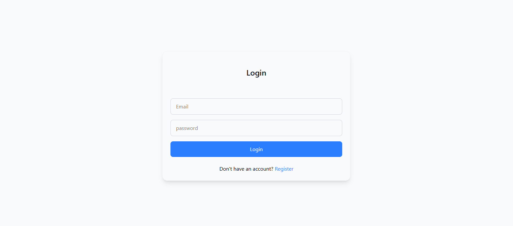

### Login Page (Mobile)
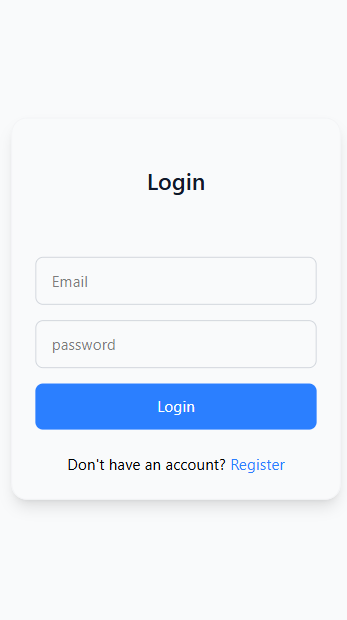

---

### Register Page (Desktop)
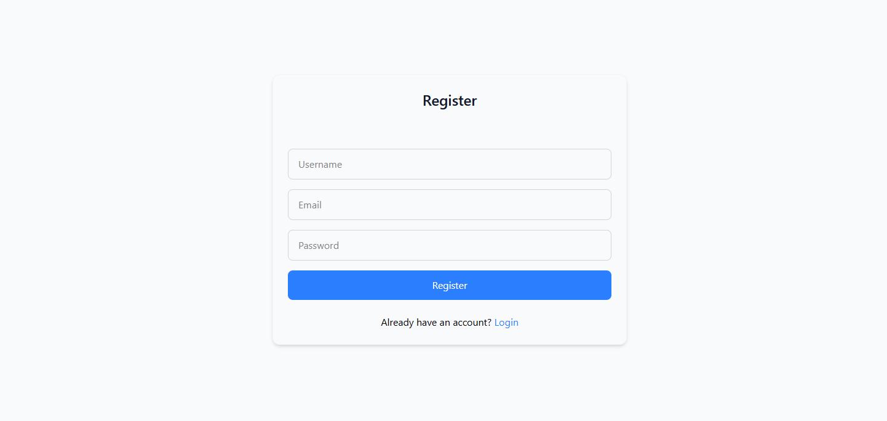

### Register Page (Mobile)
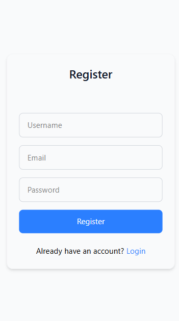

---

### Dashboard (Desktop)
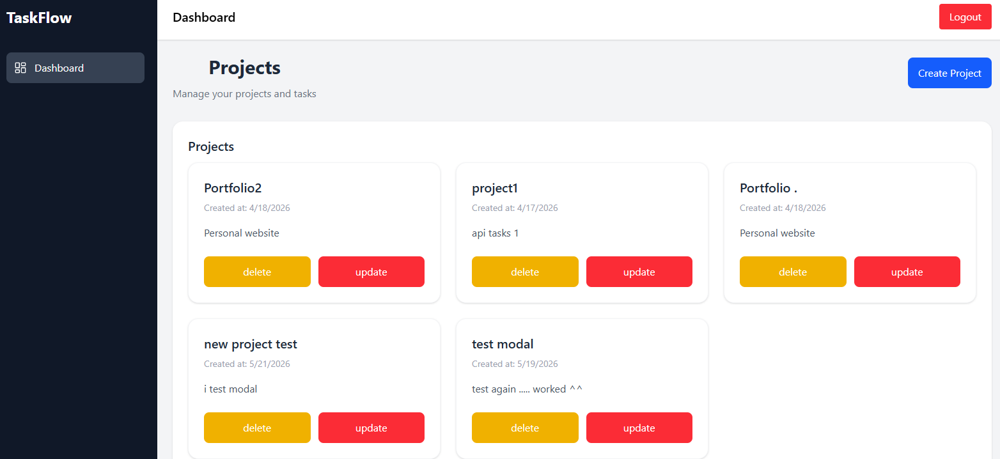

### Dashboard (Mobile)
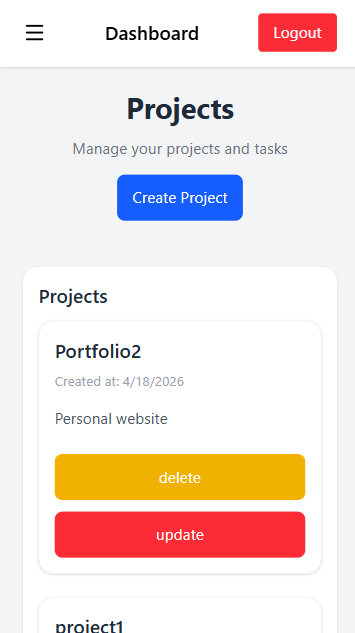

---
### Create Project
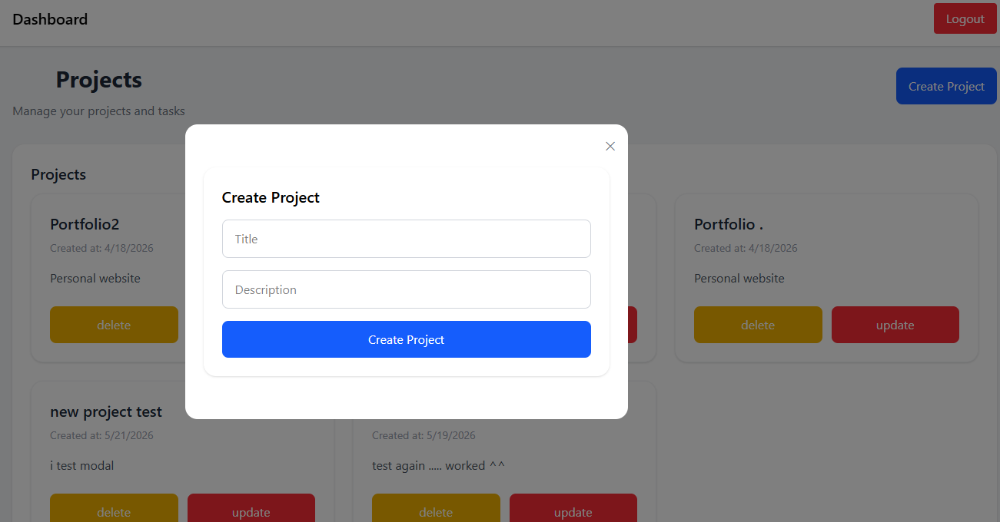

### Edit Project
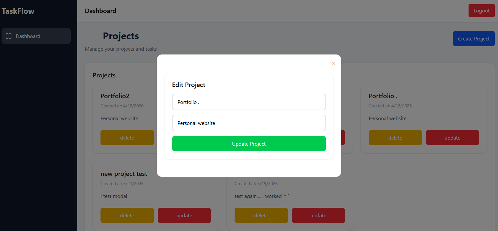

---

### Tasks Page (Desktop)
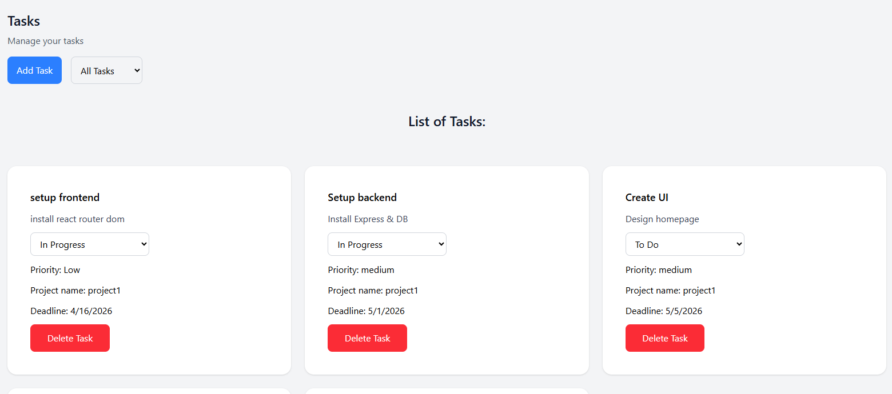

### Tasks Page (Mobile)
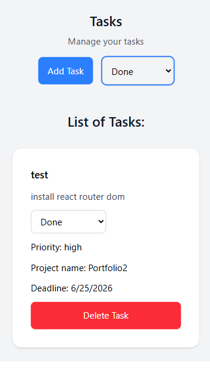

### Add Task
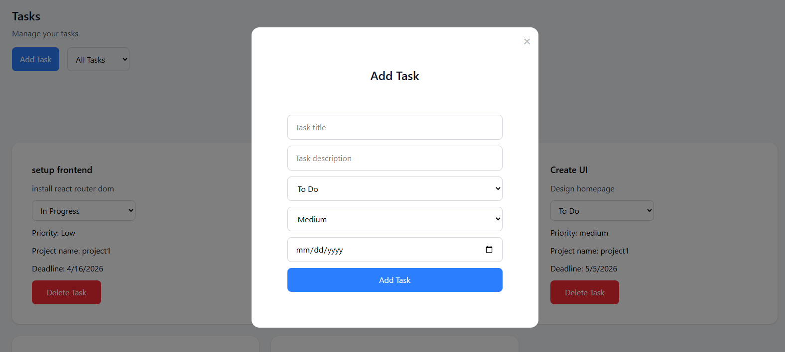

...

##  Author

Zineb Louniri


